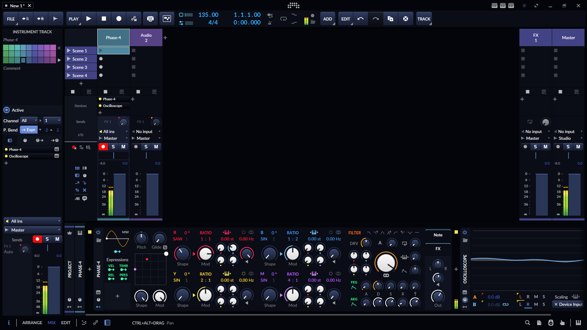

# Themes
#### by [Siku](https://siku.studio)
Still trying to figure out a few things, but it's about 85% done.

### Optional Icon
To use this instead of the default icon in Windows:
  1. Create a shortcut of the main `Bitwig.exe` file located in `.../Bitwig Studio/`
  2. Right click on it and go to properties, click the `Change Icon` button under the `General` tab
  3. `Browse` to wherever you saved this icon and select it.
  4. Now you can add that shortcut to Start or Taskbar if you want.

### Optional Splash
Save the image file to `.../Bitwig Studio/resources/` and change `studio` to whichever version you have.

